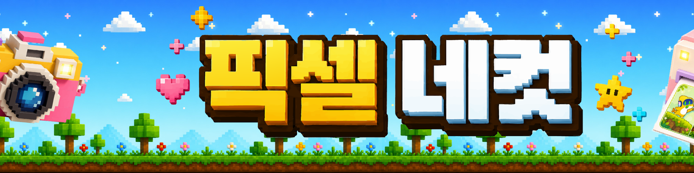
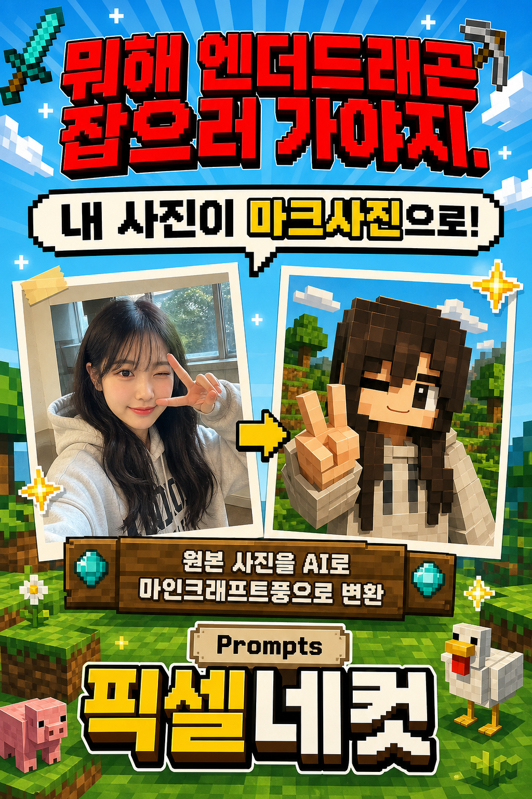
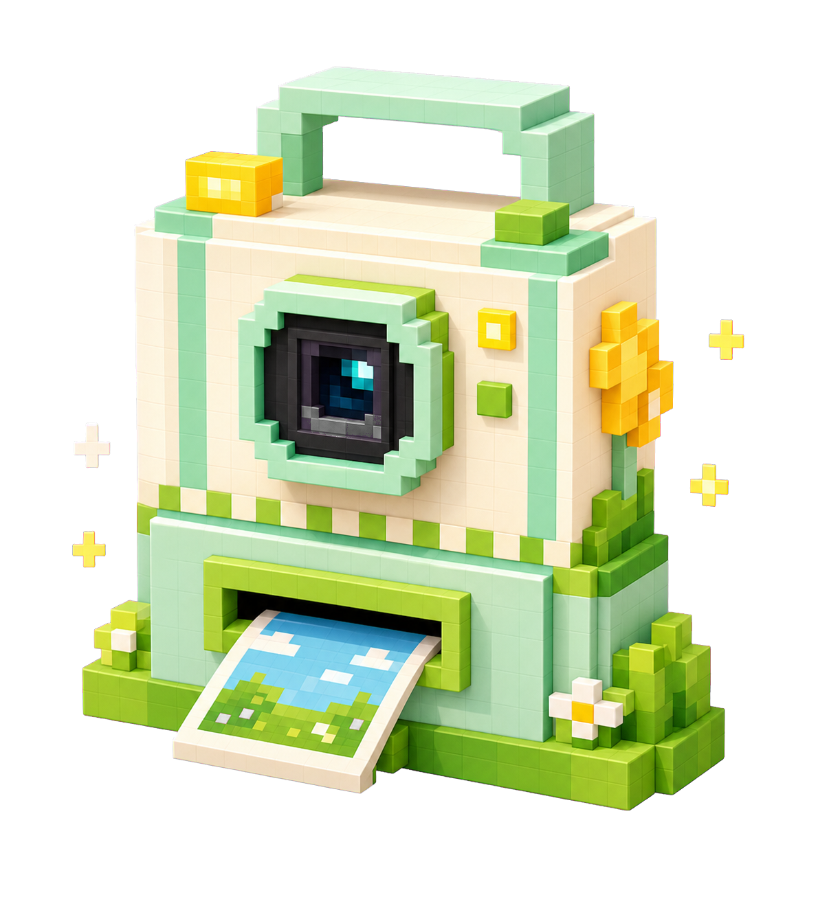
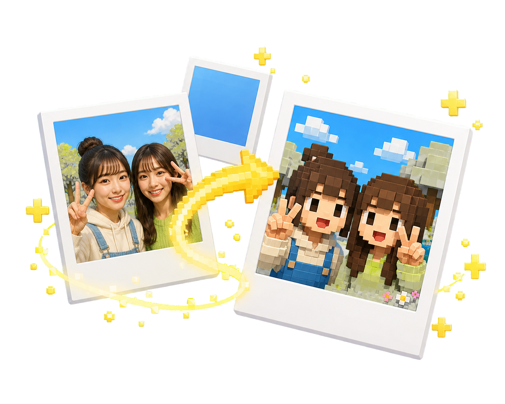
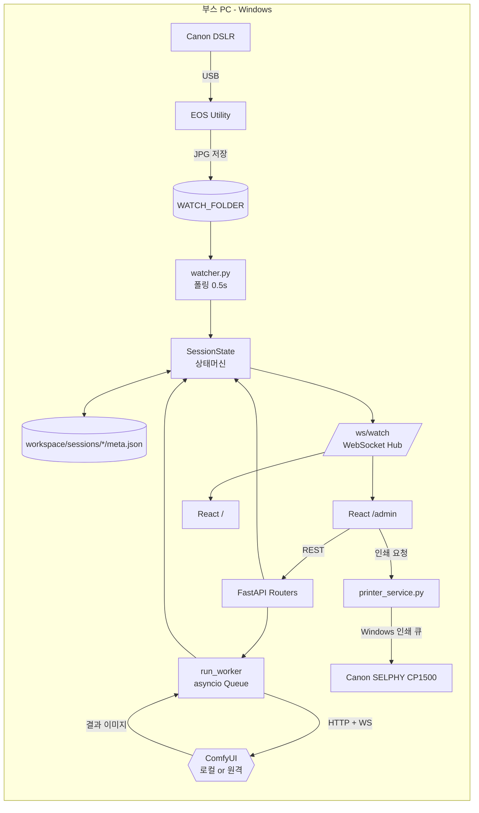
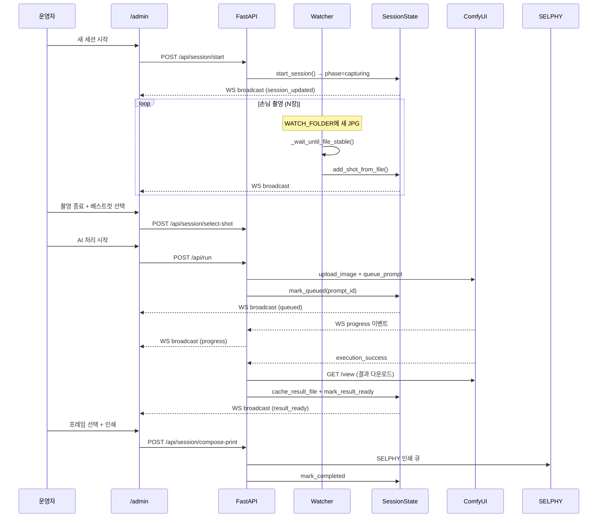

# 픽셀네컷 — AI 포토부스 부스 운영 시스템

행사장에서 손님 한 명을 1분 안에 통과시키는 게 목표였다. DSLR로 찍은 사진을 ComfyUI에 흘려보내 스타일을 입히고, 2컷으로 합쳐 SELPHY로 뽑아 손에 쥐여주는 흐름 — 그걸 운영자 한 명이 한 화면에서 굴릴 수 있게 만든 시스템.



<!-- 이미지 자리: docs/images/hero.png — 동아리 현수막 -->

---

## 이게 뭔가요

- **무엇** — 행사용 AI 포토부스. 운영자 한 명이 `/admin` 한 화면에서 촬영 → AI 변환 → 인쇄까지 굴린다. 촬영은 한 명씩, 처리·인쇄는 큐에 쌓아 병렬로.
- **왜 직접 만들었나** — 시판 키오스크는 ComfyUI 워크플로우를 자유롭게 갈아끼울 수 없고, Canon DSLR과 SELPHY를 한 흐름에 묶어주는 기성 솔루션이 없었다.
- **무엇으로 만들었나** — FastAPI + WebSocket + asyncio (백엔드), React 19 + Vite 8 (프론트), ComfyUI HTTP/WS API, Canon EOS Utility, SELPHY CP1500 (Windows 인쇄 큐).
- **무엇이 어려웠나** — 파일 워처 race condition, 여러 세션을 굴리는 상태머신, ComfyUI 워크플로우 동적 변경, 로컬/원격 GPU를 같은 코드로 다루기, 1200×1800 인쇄 레이아웃 좌표 변환, 그리고 행사 중 멈추지 않는 복구 경로.

---

## 데모 갤러리

행사 때 직접 만든 현수막·포스터 그래픽 자산입니다. 손님 사진은 초상권 보호를 위해 공개에서 제외했습니다.

### 포스터

| v1 | v2 |
|---|---|
|  |  |

### 현수막 구성 요소

| 타이틀 | 프롬프트 안내 | 카메라 부스 |
|---|---|---|
|  |  |  |

| 사진 변환 컨셉 | 하늘 배경 | 지면 스트립 |
|---|---|---|
|  |  |  |

| 구름 | 반짝임 팩 |
|---|---|
|  |  |

---

## 기술 스택

**Backend**
- Python 3.9+, FastAPI 0.115, Uvicorn, asyncio
- WebSocket (`/ws/watch`) 실시간 브로드캐스트
- httpx (ComfyUI REST) + websockets (ComfyUI WS 진행 이벤트)
- Pillow (인쇄 레이아웃 합성)

**Frontend**
- React 19, Vite 8, React Router 6
- WebSocket 자동 재연결 + Optimistic UI

**AI / Hardware**
- ComfyUI (로컬 또는 [Runyour AI Cloud](https://runyour.ai) 원격 GPU)
- Canon DSLR + EOS Utility (Live View / Tethered Shooting)
- Canon SELPHY CP1500 (Windows 인쇄 큐 직접 제어, PowerShell)

---

## 시스템 아키텍처



### 한 세션의 데이터 플로우



---

## 기술 하이라이트 6선 — 부스에서 배운 것들

코드를 쓴 이유는 대부분 책상이 아니라 행사장에서 정해졌다. 각 항목 끝에 관련 파일 경로를 남겨뒀으니 궁금하면 들어가서 보면 된다.

### 1. 워처는 단순해야 안 죽는다
초기에는 `watchfiles` 같은 이벤트 기반 워처를 썼는데, 윈도우에서 DSLR이 USB로 마운트한 폴더는 이벤트를 가끔 흘렸다. 한 장이라도 놓치면 손님은 "내 사진은요?" 하고 묻는다. 결국 0.5초 폴링으로 내려갔고, 새 파일을 발견하면 크기가 멈출 때까지 몇 차례 더 확인한 뒤에야 다음 단계로 넘긴다. DSLR이 JPG를 쓰는 중인 미완성 파일이 ComfyUI로 넘어가는 사고를 막기 위해서다. 미적으로는 못생긴 폴링이지만, 행사 8시간 동안 한 장도 놓치지 않았다.
→ [`backend/watcher.py`](backend/watcher.py)

### 2. 한 손님의 일생은 디스크에 새겨둔다
부스 PC가 한 번 꺼진 적이 있다. 전원 케이블이 빠졌다. 다행히 세션의 모든 상태를 매 변경마다 `meta.json`에 즉시 저장해두는 구조였어서, 재기동 후 디스크에서 활성 세션을 복원하고 그대로 이어 진행했다. 손님은 우리가 컴퓨터를 재부팅한 줄도 몰랐다. "메모리에만 있는 상태"는 행사장에서 사치다.
→ [`backend/session.py`](backend/session.py) (`SessionState` 클래스가 이 책임을 진다)

### 3. "촬영 중인 손님은 한 명" 규칙
한 번은 욕심을 부려 여러 손님을 동시에 촬영시켜봤다. 운영자가 화면에서 "지금 이 사진이 누구 거지?"를 계속 헷갈렸다. 그래서 정책을 단순하게 굳혔다 — 촬영은 한 번에 한 손님만, 다만 AI 처리/인쇄 단계는 여러 손님이 큐에 들어가도 된다. 이 분리 하나로 운영 부하가 절반으로 줄었다. 동시성을 늘리는 게 항상 옳지는 않다.
→ [`backend/session.py`](backend/session.py)

### 4. 스타일 핫스왑 — 손님 앞에서 워크플로우 갈아끼우기
"앞 손님이랑 다른 느낌으로 가능해요?" 행사장에서 가장 자주 들은 질문이다. 그래서 ComfyUI 워크플로우 JSON을 폴더에 모아두고, `active.json`만 바꾸면 다음 세션부터 새 스타일이 적용되도록 했다. 입력 이미지는 워크플로우 안의 `LoadImage` 노드만 동적으로 갈아끼우면 되고, 시드도 필요하면 그 자리에서 덮어쓴다. 운영자가 ComfyUI를 몰라도 스타일 전환이 가능하다는 게 중요했다.
→ [`backend/comfy_client.py`](backend/comfy_client.py), [`workspace/presets/`](workspace/presets/)

### 5. 로컬 GPU와 원격 GPU를 같은 코드로
부스마다 환경이 다르다. 어떤 행사장은 부스 PC에 GPU가 있어 ComfyUI를 로컬에서 돌리고, 어떤 행사장은 노트북뿐이라 Runyour AI Cloud의 원격 GPU를 빌렸다. 원격 게이트웨이는 인증 헤더나 Bearer 토큰을 요구해서, 모든 HTTP 호출과 WebSocket 연결에 헤더를 자동 주입하는 한 곳을 만들었다. 덕분에 부스 코드 한 줄도 안 고치고 환경변수만 바꿔서 어디서든 돌렸다.
→ [`backend/config.py`](backend/config.py), [`backend/runner.py`](backend/runner.py)

### 6. 운영자는 "되돌리기"를 가장 많이 누른다
손님 흐름은 늘 꼬인다. 사진을 잘못 골랐다, AI 결과가 마음에 안 든다, 다음 손님 차례인데 이전 세션이 안 끝났다. 정상 플로우보다 복구 플로우가 먼저였다. 촬영 다시 하기, 세션 통째로 버리기, 강제 초기화 — 운영자가 한 번 클릭으로 다음 손님에게 넘어갈 수 있는 경로를 처음부터 모든 단계에 깔아뒀다. 그리고 원격 GPU가 한 번 죽었을 때를 대비해 결과는 항상 로컬에도 캐싱한다. 원격이 죽어도 인쇄는 안 멈춘다.
→ [`backend/runner.py`](backend/runner.py), [`backend/session.py`](backend/session.py)

---

## 레포 구조

```
pixel_AI/
├── backend/
│   ├── main.py              # FastAPI 진입점, lifespan(워처+러너 2개 태스크), /ws/watch
│   ├── session.py           # SessionState 상태머신 (god node, 752줄)
│   ├── watcher.py           # 폴링 워처 + ConnectionManager (WS 허브)
│   ├── runner.py            # asyncio Queue + ComfyUI WS 진행 이벤트 처리
│   ├── comfy_client.py      # ComfyUI HTTP API (upload/queue/history/view)
│   ├── config.py            # 환경변수 + ComfyUI 헤더 조립
│   ├── printer_service.py   # SELPHY 인쇄 (Windows print queue)
│   └── routers/             # presets, upload, run, result, printing
├── frontend/
│   └── src/
│       ├── useSession.js          # WebSocket 훅 (자동 재연결)
│       ├── AdminScreen.jsx        # 운영자 UI
│       ├── PrintScreen.jsx        # 인쇄 레이아웃 편집기
│       ├── HistoryScreen.jsx      # 세션 히스토리
│       └── printLayoutMath.js     # cover-fit + 드래그/리사이즈 수학
├── docs/
│   ├── frame-design-spec.md       # 1200×1800 슬롯 좌표
│   └── printer-ops.md             # SELPHY 운영 노트
├── workspace/             # 런타임 데이터 (gitignore)
│   ├── input/             # WATCH_FOLDER 기본값
│   ├── presets/active.json
│   └── sessions/<id>/{shots,prints,meta.json,result-*.png}
├── graphify-out/          # 코드 지식그래프 (god node 분석)
└── requirements.txt / frontend/package.json
```

---

## 시작하기

### 사전 준비
- Python 3.9+, Node.js 18+
- ComfyUI 인스턴스 (로컬 또는 원격)
- (선택) Canon DSLR + EOS Utility, Canon SELPHY CP1500 + Windows 드라이버

### 설치 및 실행

```bash
# 1. 환경 변수
cp .env.example .env
# COMFYUI_URL 등을 환경에 맞게 수정

# 2. 백엔드
pip install -r requirements.txt

# 3. 프론트엔드 빌드 (FastAPI가 dist/를 서빙)
cd frontend && npm install && npm run build && cd ..

# 4. 서버 기동
./start.sh           # macOS / Linux
start.bat            # Windows
```

브라우저 접속:
- 운영자: `http://localhost:8000/admin`
- 공용 화면: `http://localhost:8000/`

### 환경 변수

| 변수 | 설명 |
|---|---|
| `COMFYUI_URL` | ComfyUI HTTP 엔드포인트. WS 변환은 자동 (`ws://`/`wss://`) |
| `COMFYUI_HEADERS_JSON` | 원격 게이트웨이용 추가 헤더 (JSON 문자열) |
| `COMFYUI_BEARER_TOKEN` | Bearer 인증 토큰 |
| `WATCH_FOLDER` | EOS Utility 저장 폴더 (기본: `workspace/input`) |
| `PRESETS_FOLDER` | ComfyUI 워크플로우 보관 (`active.json` 필수) |
| `SESSIONS_FOLDER` | 세션 영속 디렉토리 (기본: `workspace/sessions`) |

프로파일 예시: `.env.local.example` (로컬), `.env.runyour.example` (원격 GPU).

---

## Credits

- ComfyUI 워크플로우 — Stable Diffusion 커뮤니티 베이스
- 원격 GPU — [Runyour AI Cloud](https://runyour.ai)
- 하드웨어 — Canon EOS DSLR, Canon SELPHY CP1500
- 코드 지식그래프 — [`graphify-out/`](graphify-out/GRAPH_REPORT.md)

---

> 이 레포는 행사 운영 종료 후 정리한 쇼케이스 버전입니다. 일부 운영자 전용 자격증명 / 사진은 제거되어 있습니다.
