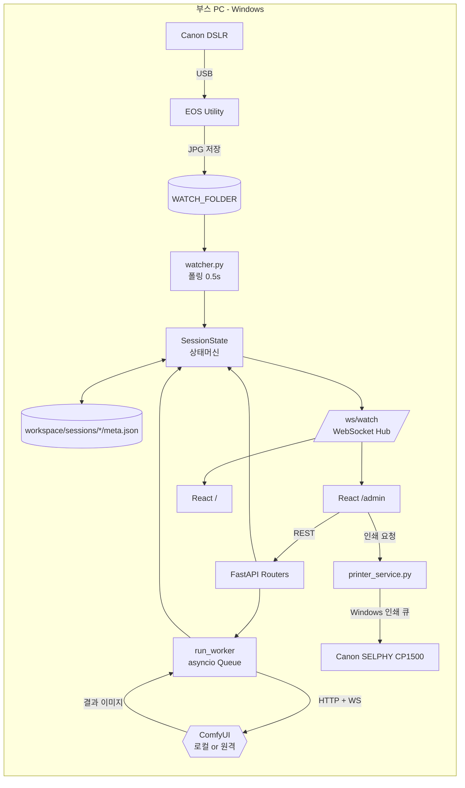
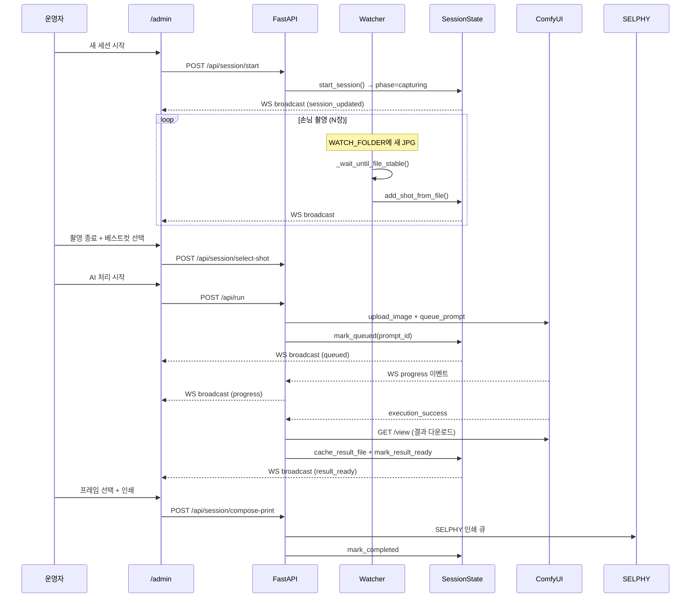

# 픽셀네컷 — AI 포토부스 부스 운영 시스템

> Canon DSLR → 파일 워처 → FastAPI 상태머신 → ComfyUI(로컬/원격 GPU) → Canon SELPHY CP1500.
> 행사장 한복판에서 손님 한 명당 60초 안에 "촬영 → AI 변환 → 4컷 인쇄"를 끝내는 실전 부스 코드.


<!-- 이미지 자리: docs/images/hero.jpg — 부스 전경 한 컷 -->

---

## TL;DR

- **무엇을 만들었나** — 행사용 AI 포토부스. 운영자 1명이 `/admin` 한 화면에서 N개의 손님 세션을 동시에 굴린다.
- **왜 직접 만들었나** — 시판 키오스크는 ComfyUI 워크플로우 핫스왑이 불가능하고, Canon DSLR + SELPHY 조합을 묶어주는 솔루션이 없었음.
- **기술 스택** — FastAPI + WebSocket + asyncio · React 19 + Vite 8 · ComfyUI HTTP/WS API · Canon EOS Utility · SELPHY CP1500 (Windows 인쇄 큐).
- **핵심 챌린지** — (1) 파일 워처 race condition, (2) 다중 세션 상태머신, (3) ComfyUI 워크플로우 동적 패치, (4) 로컬/원격 GPU 추상화, (5) 1200×1800 인쇄 레이아웃 수학, (6) 행사 중 강제 복구.

---

## 데모 갤러리

| 부스 외관 | 운영자 화면 (`/admin`) | 공용 화면 (`/`) |
|---|---|---|
|  |  |  |

| 원본 컷 | AI 변환 결과 | 4컷 인쇄본 |
|---|---|---|
|  |  |  |

<!-- 이미지 자리:
  docs/images/booth.jpg          — 부스 셋업 사진
  docs/images/admin.png          — /admin 스크린샷
  docs/images/public.png         — / 공용 화면 스크린샷
  docs/images/sample-raw.jpg     — 촬영 원본
  docs/images/sample-ai.jpg      — ComfyUI 결과
  docs/images/sample-print.jpg   — 최종 인쇄 레이아웃
  docs/images/demo.gif           — 30초 시연 영상(선택)
-->

---

## 기술 스택

**Backend**
- Python 3.9+, FastAPI 0.115, Uvicorn, asyncio
- WebSocket (`/ws/watch`) 실시간 브로드캐스트
- httpx (ComfyUI REST) + websockets (ComfyUI WS 진행 이벤트)
- Pillow (인쇄 레이아웃 합성)

**Frontend**
- React 19, Vite 8, React Router 6
- WebSocket 자동 재연결 + Optimistic UI

**AI / Hardware**
- ComfyUI (로컬 또는 [Runyour AI Cloud](https://runyour.ai) 원격 GPU)
- Canon DSLR + EOS Utility (Live View / Tethered Shooting)
- Canon SELPHY CP1500 (Windows 인쇄 큐 직접 제어, PowerShell)

---

## 시스템 아키텍처



### 한 세션의 데이터 플로우



---

## 기술 하이라이트 6선

### 1. 파일 워처: race condition을 죽이는 폴링 + size-stable 체크
DSLR이 JPG를 쓰는 동안 워처가 미완성 파일을 잡아 ComfyUI에 던지면 처리 실패가 났다. `watchfiles` 패키지가 의존성에 있지만 실제로는 **0.5초 폴링 + 8회 size-stable 재확인** 방식이 더 안정적이라 그쪽으로 갔다.

```python
# backend/watcher.py
async def _wait_until_file_stable(path: Path, retries: int = 8, delay: float = 0.2):
    previous_size = -1
    for _ in range(retries):
        current_size = path.stat().st_size
        if current_size > 0 and current_size == previous_size:
            return
        previous_size = current_size
        await asyncio.sleep(delay)
```
→ [`backend/watcher.py`](backend/watcher.py)

### 2. SessionState — 영속 상태머신 (god node)
`capturing → reviewing → queued → processing → result_ready → completed` 의 phase 전이를 단일 클래스가 책임진다. **모든 변경은 즉시 `meta.json`에 flush** 되므로 부스 PC가 꺼져도 재기동 시 `load_from_disk()`로 활성 세션을 복원한다. 동시에 처리 중 세션은 N개까지 가능하지만 **`active_capture_session_id` (촬영 중인 세션)는 유일하다** — 이게 운영자 인지 부하를 결정적으로 줄였다.

→ [`backend/session.py`](backend/session.py) (752줄, `SessionState` 클래스 전체)

### 3. ComfyUI 워크플로우 동적 패치 + 프리셋 핫스왑
운영 중 "이번 손님은 다른 스타일로" 같은 요청이 들어왔을 때 `workspace/presets/active.json`만 교체하면 다음 세션부터 즉시 반영된다. 워크플로우 JSON을 deepcopy 한 뒤 `LoadImage` 노드의 입력만 갈아끼고 시드도 옵션으로 override.

```python
# backend/comfy_client.py
def patch_workflow(workflow: dict, filename: str, seed_override=None) -> dict:
    wf = copy.deepcopy(workflow)
    for node in wf.values():
        inputs = node.get("inputs", {})
        if node.get("class_type") == "LoadImage":
            inputs["image"] = filename
        if seed_override is not None:
            for key in ("seed", "noise_seed"):
                if key in inputs:
                    inputs[key] = seed_override
    return wf
```
→ [`backend/comfy_client.py`](backend/comfy_client.py)

### 4. 로컬/원격 GPU 추상화 — Runyour 프록시 헤더 주입
같은 코드를 (a) 부스 PC의 로컬 ComfyUI와 (b) Runyour AI Cloud의 원격 GPU 양쪽에 붙일 수 있어야 했다. 원격 쪽은 게이트웨이가 커스텀 헤더 또는 Bearer 토큰을 요구해서, **모든 httpx 클라이언트와 ComfyUI WebSocket 연결에 `get_comfyui_headers()`를 일괄 주입**하는 구조로 통일.

```python
# backend/runner.py — ComfyUI WS도 같은 헤더 주입
async with websockets.connect(
    f"{ws_url}/ws?clientId={client_id}",
    additional_headers=get_comfyui_headers() or None,
) as ws:
    ...
```
환경변수 `COMFYUI_HEADERS_JSON`(JSON 문자열) / `COMFYUI_BEARER_TOKEN` 두 가지를 모두 지원.
→ [`backend/runner.py`](backend/runner.py), [`backend/config.py`](backend/config.py)

### 5. 1200×1800 인쇄 레이아웃 수학 — cover-fit + 드래그/리사이즈
SELPHY CP1500의 L판(89×119mm, 약 1200×1800px @ 300dpi) 안에 4컷을 cover 방식으로 채우면서, 운영자가 프레임 안에서 컷을 드래그/리사이즈할 수 있어야 했다. 핵심은 **프리뷰 좌표(브라우저 픽셀)와 인쇄 좌표(1200×1800)를 `previewScale`로 일관 변환**하는 것.

```js
// frontend/src/printLayoutMath.js
export function applyResizeDelta({ origin, handle, baseSize, startScale, deltaX, deltaY, previewScale }) {
  const startWidth = baseSize.width * startScale
  const logicalDeltaX = deltaX / previewScale          // 프리뷰 → 인쇄 좌표 변환
  const nextWidth = Math.max(baseSize.width, startWidth + handle.sx * logicalDeltaX)
  const nextScale = clampScale(Math.max(nextWidth / baseSize.width, ...))
  ...
}
```
→ [`frontend/src/printLayoutMath.js`](frontend/src/printLayoutMath.js), [`docs/frame-design-spec.md`](docs/frame-design-spec.md)

### 6. 행사 중 장애 내성 — 강제 초기화, 결과 로컬 캐시, ComfyUI 재연결
실전에서 가장 무서운 건 "줄 서 있는 손님 앞에서 멈춤"이다. 그래서 세 가지를 깔아뒀다:

- **`run_worker`의 5회 재시도** — ComfyUI WS가 끊겨도 백오프 후 재연결, 마지막에 history API로 결과 회수 시도. ([runner.py:79-149](backend/runner.py))
- **결과 로컬 캐시** — 원격 GPU의 결과를 `workspace/sessions/<id>/result-NNN.*`에 즉시 저장. Runyour 세션이 죽어도 인쇄/재확인은 로컬에서 가능. ([session.py `cache_result_file`](backend/session.py))
- **강제 초기화 버튼** — 운영자가 `/admin`에서 한 번에 active session을 비우고 다음 손님으로 넘어갈 수 있도록 `discard_session()` 노출.

---

## 레포 구조

```
pixel_AI/
├── backend/
│   ├── main.py              # FastAPI 진입점, lifespan(워처+러너 2개 태스크), /ws/watch
│   ├── session.py           # SessionState 상태머신 (god node, 752줄)
│   ├── watcher.py           # 폴링 워처 + ConnectionManager (WS 허브)
│   ├── runner.py            # asyncio Queue + ComfyUI WS 진행 이벤트 처리
│   ├── comfy_client.py      # ComfyUI HTTP API (upload/queue/history/view)
│   ├── config.py            # 환경변수 + ComfyUI 헤더 조립
│   ├── printer_service.py   # SELPHY 인쇄 (Windows print queue)
│   └── routers/             # presets, upload, run, result, printing
├── frontend/
│   └── src/
│       ├── useSession.js          # WebSocket 훅 (자동 재연결)
│       ├── AdminScreen.jsx        # 운영자 UI
│       ├── PrintScreen.jsx        # 인쇄 레이아웃 편집기
│       ├── HistoryScreen.jsx      # 세션 히스토리
│       └── printLayoutMath.js     # cover-fit + 드래그/리사이즈 수학
├── docs/
│   ├── frame-design-spec.md       # 1200×1800 슬롯 좌표
│   └── printer-ops.md             # SELPHY 운영 노트
├── workspace/             # 런타임 데이터 (gitignore)
│   ├── input/             # WATCH_FOLDER 기본값
│   ├── presets/active.json
│   └── sessions/<id>/{shots,prints,meta.json,result-*.png}
├── graphify-out/          # 코드 지식그래프 (god node 분석)
└── requirements.txt / frontend/package.json
```

---

## 시작하기

### 사전 준비
- Python 3.9+, Node.js 18+
- ComfyUI 인스턴스 (로컬 또는 원격)
- (선택) Canon DSLR + EOS Utility, Canon SELPHY CP1500 + Windows 드라이버

### 설치 및 실행

```bash
# 1. 환경 변수
cp .env.example .env
# COMFYUI_URL 등을 환경에 맞게 수정

# 2. 백엔드
pip install -r requirements.txt

# 3. 프론트엔드 빌드 (FastAPI가 dist/를 서빙)
cd frontend && npm install && npm run build && cd ..

# 4. 서버 기동
./start.sh           # macOS / Linux
start.bat            # Windows
```

브라우저 접속:
- 운영자: `http://localhost:8000/admin`
- 공용 화면: `http://localhost:8000/`

### 환경 변수

| 변수 | 설명 |
|---|---|
| `COMFYUI_URL` | ComfyUI HTTP 엔드포인트. WS 변환은 자동 (`ws://`/`wss://`) |
| `COMFYUI_HEADERS_JSON` | 원격 게이트웨이용 추가 헤더 (JSON 문자열) |
| `COMFYUI_BEARER_TOKEN` | Bearer 인증 토큰 |
| `WATCH_FOLDER` | EOS Utility 저장 폴더 (기본: `workspace/input`) |
| `PRESETS_FOLDER` | ComfyUI 워크플로우 보관 (`active.json` 필수) |
| `SESSIONS_FOLDER` | 세션 영속 디렉토리 (기본: `workspace/sessions`) |

프로파일 예시: `.env.local.example` (로컬), `.env.runyour.example` (원격 GPU).

---

## 부스 운영 회고

실제 행사 운영하면서 코드 결정에 직접 영향을 준 것들.

**1. "촬영 중 세션 1개" 제약은 옳았다**
N개 동시 촬영을 허용하면 운영자가 어느 손님 사진을 보고 있는지 헷갈린다. `active_capture_session_id` 단일 슬롯 + 처리/인쇄 단계는 N개 큐 — 이 분리가 운영 부하를 절반으로 줄였다.

**2. 결과 로컬 캐시는 보험이 아니라 필수였다**
원격 GPU 인스턴스가 행사 중간에 한 번 죽었다. 결과를 로컬에 미리 저장해뒀던 덕에 인쇄는 멈추지 않았다. 이후 "원격은 처리 전용, 인쇄/재확인은 로컬"이 기본 원칙이 됨.

**3. 운영자는 "되돌리기" 버튼을 가장 많이 누른다**
`retry_capture`, `discard_session`, 강제 초기화 — 손님 흐름이 꼬였을 때 즉시 리셋할 수 있는 경로가 없으면 줄이 밀린다. 정상 플로우보다 **복구 플로우를 먼저 설계**해야 한다.

**4. 인쇄 레이아웃 편집은 직관 > 정밀**
운영자는 행사장에서 마우스 드래그로 컷을 옮길 시간만 있다. 수치 입력 UI는 다 빠지고 드래그/핀치만 남았다. `printLayoutMath.js`의 좌표 변환이 이 결정을 가능하게 했다.

**5. 워처는 단순할수록 안 죽는다**
`watchfiles` 도입을 시도했지만, 윈도우 USB 마운트 폴더에서 inotify 계열이 가끔 이벤트를 흘렸다. 0.5초 폴링이 미적이지는 않지만 행사 8시간 동안 한 장도 놓치지 않았다.

---

## Credits

- ComfyUI 워크플로우 — Stable Diffusion 커뮤니티 베이스
- 원격 GPU — [Runyour AI Cloud](https://runyour.ai)
- 하드웨어 — Canon EOS DSLR, Canon SELPHY CP1500
- 코드 지식그래프 — [`graphify-out/`](graphify-out/GRAPH_REPORT.md)

---

> 이 레포는 행사 운영 종료 후 정리한 쇼케이스 버전입니다. 일부 운영자 전용 자격증명 / 사진은 제거되어 있습니다.
